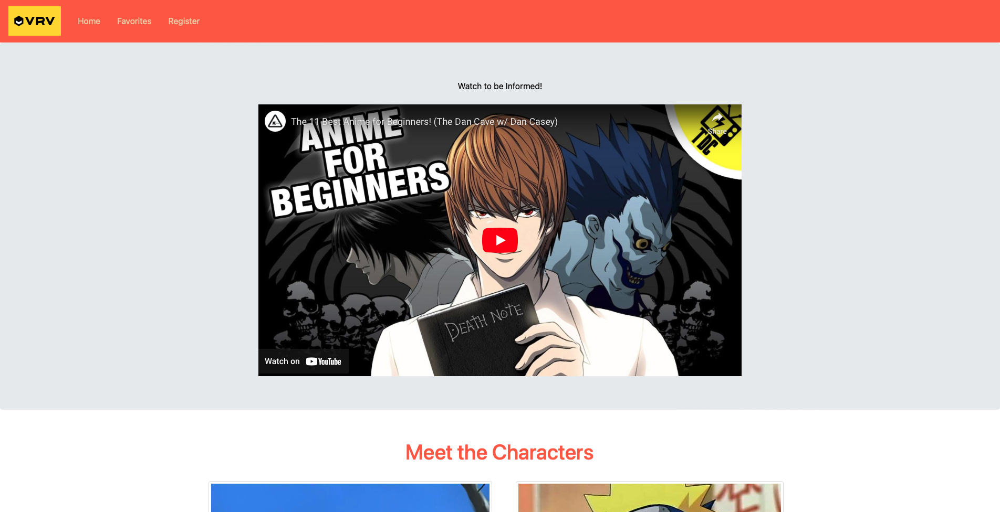
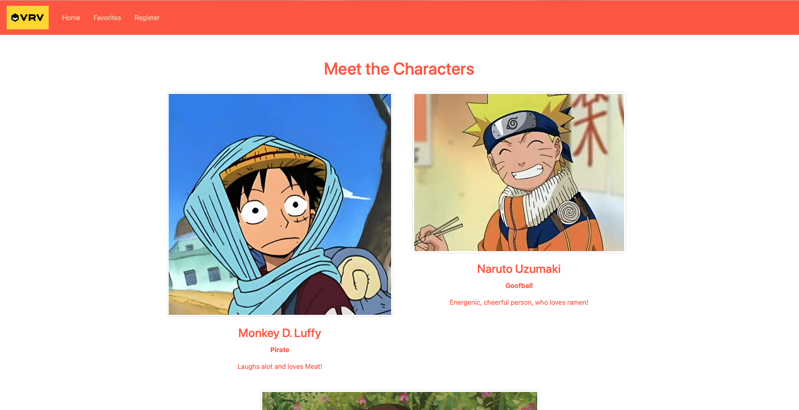
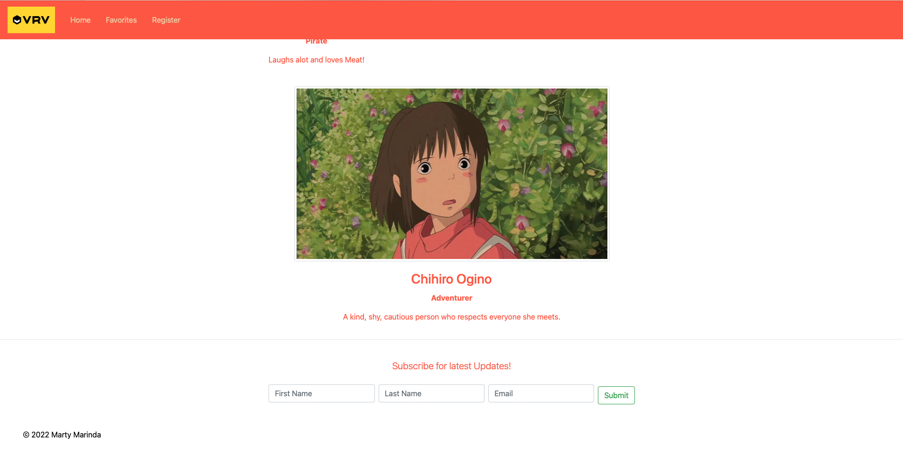
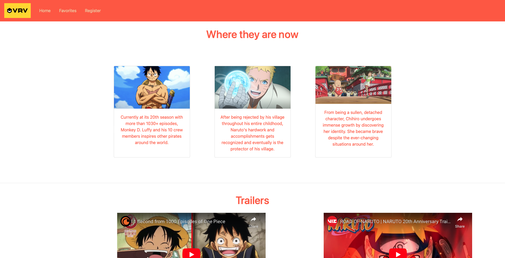
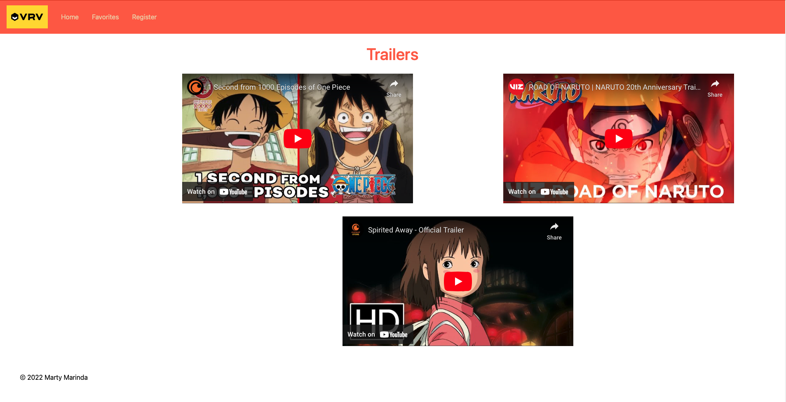
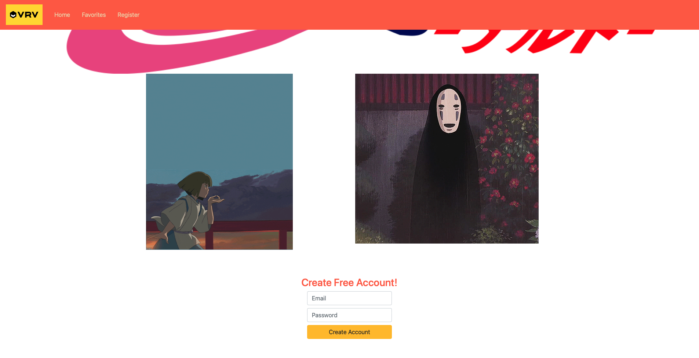

# Anime Website Redesign

[Redesigned Site](https://mxrtydluffy.github.io/Anime-Website-Redesign/)

Anime has been out for decades but many don't know what show to begin with. Fear not this website provides my personal top three bingeworthy anime to watch for beginners. This site is redesigned for a more clean layout.

## Previous Design

    
    
    

    
    

    
    

## Features added

- Custom Font
- Flex Box
- 12-column grid
